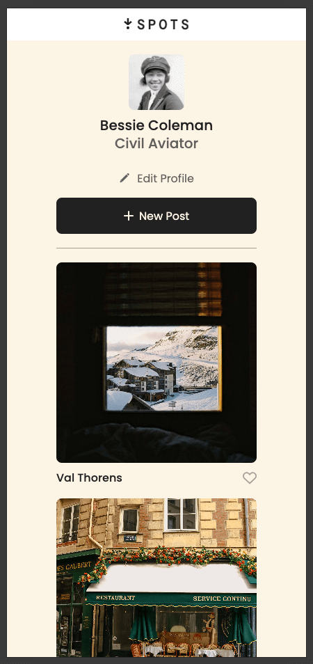

# Project 3: Spots

### Overview

- Description
- Functionality
- Techniques
- Images
- Link

**Description**

An interactive social media web application where users can add and remove photos, like photos of other users, and make a few minor adjustments to their profile

**Functionality**

Implementing responsive design, this project is made so all the elements are displayed correctly on popular screen sizes. The design brief mockup was provided using Figma, the code was implemented in VS Studio and QA tested in the Chrome inspect element.

**Techniques**

- Figma
- BEM
- Flex layout
- Grid layout
- Hover state
- Media queries
- Import fonts via @font-face

**Images**

**Links**

- Site
  https://tsims1893.github.io/se_project_spots/

- Video
  https://drive.google.com/file/d/1ZHH9Zx3dMlY-hM3avHuzfcYfk0cfKziN/view?usp=sharing
